# JOUR 1 — Infrastructure de base & pare-feu OPNsense

## Objectifs
- Installer et configurer le pare-feu OPNsense avec 3 zones (WAN, DMZ, LAN)
- Créer les VMs Red Hat Enterprise Linux, Ubuntu Server et Windows 10
- Configurer le réseau avec IP statique
- Installer le serveur web Apache sur la DMZ
- Tester la connectivité entre les zones

---

## 1. Architecture réseau finale

### Topologie

```
                        INTERNET
                           ↓
                    ┌──────────────┐
                    │   OPNsense   │
                    │  (Pare-feu)  │
                    │              │
                    │  WAN (NAT)   │ ← 10.0.2.15 (DHCP)
                    │  LAN         │ ← 192.168.56.254/24
                    │  DMZ         │ ← 192.168.57.254/24
                    └──────────────┘
                           ↓
          ┌────────────────┼────────────────┐
          ↓                ↓                ↓
    ┌──────────┐    ┌──────────┐    ┌──────────┐
    │   LAN    │    │   DMZ    │    │   WAN    │
    │192.168.56│    │192.168.57│    │ Internet │
    │  .0/24   │    │  .0/24   │    │          │
    └──────────┘    └──────────┘    └──────────┘
         ↓               ↓
    ┌─────────┐    ┌─────────┐
    │ srv-ad01│    │srv-web01│
    │  .56.10 │    │  .57.10 │
    └─────────┘    └─────────┘
         ↓
    ┌──────────┐
    │srv-backup│
    │  .56.12  │
    └──────────┘
```

### Plan d'adressage IP

| Machine | Zone | Adresse IP | Passerelle | Rôle |
|---------|------|------------|------------|------|
| OPNsense (LAN) | LAN | 192.168.56.254/24 | - | Passerelle LAN |
| OPNsense (DMZ) | DMZ | 192.168.57.254/24 | - | Passerelle DMZ |
| OPNsense (WAN) | WAN | 10.0.2.15/24 | 10.0.2.2 | Internet |
| srv-ad01 | LAN | 192.168.56.10/24 | 192.168.56.254 | FreeIPA, DNS, Samba |
| srv-backup01 | LAN | 192.168.56.12/24 | 192.168.56.254 | Sauvegardes |
| srv-web01 | DMZ | 192.168.57.10/24 | 192.168.57.254 | Serveur Web (Apache) |
| poste-win01 | LAN | 192.168.56.102/24 | 192.168.56.254 | Client Windows |
| PC Parrot (hôte) | LAN | 192.168.56.254/24 | - | Poste d'administration |

---

## 2. Configuration des VMs

### VM 1 : OPNsense (Pare-feu)

| Paramètre | Valeur |
|-----------|--------|
| Nom | OPNsense |
| Type | BSD / FreeBSD (64-bit) |
| RAM | 4096 Mo (4 Go) |
| CPU | 2 cœurs |
| Disque | 20 Go (VDI, dynamique) |
| Adapter 1 | NAT (Internet) |
| Adapter 2 | Host-Only (vboxnet0 - LAN) |
| Adapter 3 | Host-Only (vboxnet1 - DMZ) |
| OS installé | OPNsense 26.1 |

### VM 2 : srv-ad01-file01-mon01

| Paramètre | Valeur |
|-----------|--------|
| Nom | srv-ad01-file01-mon01 |
| Type | Red Hat (64-bit) |
| RAM | 8192 Mo (8 Go) |
| CPU | 4 cœurs |
| Disque 1 (système) | 40 Go (VDI, dynamique) |
| Disque 2 (données) | 40 Go (VDI, dynamique) |
| Adapter 1 | NAT (Internet) |
| Adapter 2 | Host-Only (vboxnet0 - LAN) |
| OS installé | RHEL 9.8 (Server, sans GUI) |

### VM 3 : srv-backup01

| Paramètre | Valeur |
|-----------|--------|
| Nom | srv-backup01 |
| Type | Red Hat (64-bit) |
| RAM | 4096 Mo (4 Go) |
| CPU | 2 cœurs |
| Disque 1 | 40 Go (VDI, dynamique) |
| Adapter 1 | NAT (Internet) |
| Adapter 2 | Host-Only (vboxnet0 - LAN) |
| OS installé | RHEL 9.8 (Server, sans GUI) |

### VM 4 : poste-win01

| Paramètre | Valeur |
|-----------|--------|
| Nom | poste-win01 |
| Type | Microsoft Windows (64-bit) |
| RAM | 4096 Mo (4 Go) |
| CPU | 2 cœurs |
| Disque 1 | 50 Go (VDI, dynamique) |
| Adapter 1 | NAT (Internet) |
| Adapter 2 | Host-Only (vboxnet0 - LAN) |
| OS installé | Windows 10 |

### VM 5 : srv-web01 (Serveur Web - DMZ)

| Paramètre | Valeur |
|-----------|--------|
| Nom | srv-web01 |
| Type | Linux / Ubuntu (64-bit) |
| RAM | 4096 Mo (4 Go) |
| CPU | 2 cœurs |
| Disque 1 | 40 Go (VDI, dynamique) |
| Adapter 1 | Host-Only (vboxnet1 - DMZ) |
| Pas de NAT | Sécurité renforcée |
| OS installé | Ubuntu Server 24.04 |

---

## 3. Création des réseaux VirtualBox

### Réseau vboxnet0 (LAN)

| Paramètre | Valeur |
|-----------|--------|
| Nom | vboxnet0 |
| Adresse IPv4 | 192.168.56.1 |
| Masque | 255.255.255.0 |
| DHCP Server | Désactivé |

### Réseau vboxnet1 (DMZ)

| Paramètre | Valeur |
|-----------|--------|
| Nom | vboxnet1 |
| Adresse IPv4 | 192.168.57.1 |
| Masque | 255.255.255.0 |
| DHCP Server | Désactivé |

---

## 4. Installation d'OPNsense

### Étape 1 — Installation

1. Télécharger l'ISO OPNsense depuis https://opnsense.org/download/
2. Créer la VM avec les paramètres ci-dessus
3. Monter l'ISO et démarrer
4. Login : `installer` / Mot de passe : `opnsense`
5. Sélectionner **Install (ZFS)** → **Stripe**
6. Définir le mot de passe root
7. Redémarrer

### Étape 2 — Configuration des interfaces

```bash
# Assigner les interfaces
1) Assign interfaces
→ LAGGs: n
→ VLANs: n
→ WAN: em0
→ LAN: em1
→ DMZ: em2

# Configurer l'IP du LAN
2) Set interface IP address
→ Interface: 1 (LAN)
→ DHCP: n
→ IP: 192.168.56.254
→ Subnet: 24
→ Gateway: (Entrée)
→ DHCP LAN: n
→ Wizard: n
```

### Étape 3 — Configuration de la DMZ

```bash
2) Set interface IP address
→ Interface: 2 (OPT1)
→ DHCP: n
→ IP: 192.168.57.254
→ Subnet: 24
→ Gateway: (Entrée)
→ DHCP OPT1: n
```

### Étape 4 — Configuration via l'interface web

1. Accéder à `https://192.168.56.254`
2. Login : `root` / Mot de passe défini
3. Suivre le wizard :
   - Hostname : OPNsense
   - Domain : novatech.local
   - DNS : 8.8.8.8
   - WAN : DHCP
   - LAN : 192.168.56.254/24
   - DHCP : activé
4. Appliquer

---

## 5. Configuration réseau des VMs

### srv-ad01 (RHEL)

```bash
# Vérifier les interfaces
nmcli device status

# Créer la connexion Host-Only
sudo nmcli con add con-name "Host-Only" ifname enp0s8 type ethernet

# Configurer l'IP statique
sudo nmcli con mod "Host-Only" ipv4.addresses 192.168.56.10/24
sudo nmcli con mod "Host-Only" ipv4.gateway 192.168.56.254
sudo nmcli con mod "Host-Only" ipv4.method manual
sudo nmcli con mod "Host-Only" ipv4.dns "192.168.56.254 8.8.8.8"

# Activer la connexion
sudo nmcli con up "Host-Only"

# Vérifier
ip addr show enp0s8
ip route
```

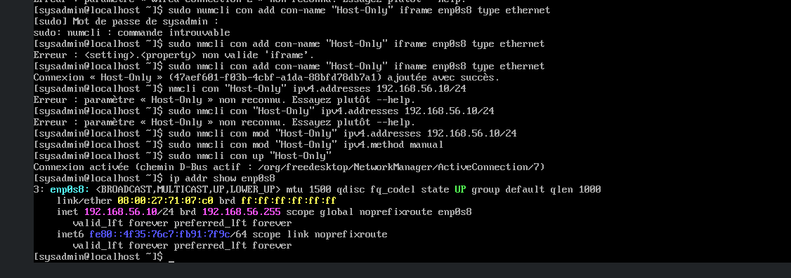

### srv-backup01 (RHEL)

```bash
# Créer la connexion Host-Only
sudo nmcli con add con-name "Host-Only" ifname enp0s8 type ethernet

# Configurer l'IP statique
sudo nmcli con mod "Host-Only" ipv4.addresses 192.168.56.12/24
sudo nmcli con mod "Host-Only" ipv4.gateway 192.168.56.254
sudo nmcli con mod "Host-Only" ipv4.method manual
sudo nmcli con mod "Host-Only" ipv4.dns "192.168.56.254 8.8.8.8"

# Activer la connexion
sudo nmcli con up "Host-Only"

# Vérifier
ip addr show enp0s8
ping 192.168.56.254
ping 8.8.8.8
ping google.com
```

### poste-win01 (Windows 10)

1. **Paramètres → Réseau et Internet → Ethernet**
2. **Modifier les options de l'adaptateur**
3. Clic droit sur l'adaptateur → **Propriétés**
4. **Protocole Internet version 4 (TCP/IPv4)** → **Propriétés**
5. Configurer :
   - Adresse IP : `192.168.56.102`
   - Masque : `255.255.255.0`
   - Passerelle : `192.168.56.254`
   - DNS : `192.168.56.254`

---

## 6. Configuration de srv-web01 (Serveur Web - DMZ)

### Installation

1. Créer la VM avec les paramètres ci-dessus
2. Monter l'ISO Ubuntu Server
3. Démarrer l'installation

### Configuration réseau pendant l'installation

- **Network configuration** : configurez l'adaptateur enp0s8 avec IP statique
- **IP Address** : `192.168.57.10/24`
- **Gateway** : `192.168.57.254`
- **Name servers** : `192.168.57.254, 8.8.8.8`
- **Search domains** : `novatech.local`

### Configuration réseau (si pas fait pendant l'installation)

```bash
# Vérifier les interfaces
ip addr show

# Configurer l'IP statique sur netplan
sudo nano /etc/netplan/00-installer-config.yaml
```

Contenu du fichier :
```yaml
network:
  version: 2
  ethernets:
    enp0s8:
      dhcp4: no
      addresses:
        - 192.168.57.10/24
      routes:
        - to: default
          via: 192.168.57.254
      nameservers:
        addresses:
          - 192.168.57.254
          - 8.8.8.8
        search:
          - novatech.local
```

Appliquer :
```bash
sudo netplan apply
```

### Installation d'Apache

```bash
# Mettre à jour le système
sudo apt update && sudo apt upgrade -y

# Installer Apache
sudo apt install apache2 -y

# Démarrer et activer le service
sudo systemctl start apache2
sudo systemctl enable apache2

# Vérifier le statut
sudo systemctl status apache2

# Ouvrir le pare-feu
sudo ufw allow 'Apache Full'
sudo ufw enable

# Créer une page de test
echo "<h1>NovaTech - Serveur Web (DMZ)</h1>" | sudo tee /var/www/html/index.html
```

### Tests

```bash
# Depuis srv-web01
ping 192.168.57.254  # ✅ Passerelle DMZ accessible
ping 8.8.8.8         # ✅ Internet accessible (si NAT activé)

# Depuis le PC Parrot
ping 192.168.57.10   # ✅ srv-web01 accessible
http://192.168.57.10 # ✅ Page web affichée
```

---

## 7. Configuration des règles de pare-feu

### Règle NAT sortant

Dans OPNsense :
1. **Firewall → NAT → Outbound**
2. Mode : **Hybrid outbound NAT rule generation**
3. Les règles automatiques sont créées pour LAN → WAN

### Règle de pare-feu LAN

Dans OPNsense :
1. **Firewall → Rules → LAN**
2. Ajouter une règle :
   - **Action** : Pass
   - **Interface** : LAN
   - **Source** : LAN net
   - **Destination** : any
3. **Save** → **Apply changes**

### Règle de pare-feu DMZ

Dans OPNsense :
1. **Firewall → Rules → OPT1**
2. Vérifier ou ajouter une règle :
   - **Action** : Pass
   - **Interface** : OPT1
   - **Source** : OPT1 net
   - **Destination** : any
3. **Save** → **Apply changes**

### Activation de l'interface DMZ

Dans OPNsense :
1. **Interfaces → OPT1**
2. Vérifier que **Enable** est coché ✅
3. **IPv4 Configuration Type** : Static IPv4
4. **IPv4 Address** : `192.168.57.254/24`
5. **Save** → **Apply changes**

---

## 8. Tests de connectivité

### Depuis srv-backup01 (LAN)

```bash
# Test vers la passerelle
ping 192.168.56.254
# Résultat : ✅ 9 paquets transmis, 9 reçus, 0% perte

# Test vers Internet
ping 8.8.8.8
# Résultat : ✅ 9 paquets transmis, 9 reçus, 0% perte

# Test DNS
ping google.com
# Résultat : ✅ Résolution DNS fonctionnelle
```

### Depuis srv-ad01 (LAN)

```bash
ping 192.168.56.254  # ✅ Passerelle accessible
ping 8.8.8.8         # ✅ Internet accessible
ping google.com      # ✅ DNS fonctionnel
```

### Depuis srv-web01 (DMZ)

```bash
ping 192.168.57.254  # ✅ Passerelle DMZ accessible
ping 8.8.8.8         # ✅ Internet accessible
ping google.com      # ✅ DNS fonctionnel
```

### Depuis le PC Parrot

```bash
# Test LAN
ping 192.168.56.10   # ✅ srv-ad01 accessible
ping 192.168.56.12   # ✅ srv-backup01 accessible

# Test DMZ
ping 192.168.57.10   # ✅ srv-web01 accessible
```

### Test de la page web

Depuis le PC Parrot, ouvrez un navigateur :
```
http://192.168.57.10
```
Résultat : ✅ Page "NovaTech - Serveur Web (DMZ)" affichée

---

## 9. Résolution des problèmes rencontrés

### Problème 1 : Pas d'accès Internet (LAN)

**Symptôme** : `ping 8.8.8.8` échoue avec "Le réseau n'est pas accessible"

**Cause** : Route par défaut manquante

**Solution** :
```bash
sudo ip route add default via 192.168.56.254
```

Pour rendre la route permanente :
```bash
sudo nmcli con mod "Host-Only" ipv4.gateway 192.168.56.254
sudo nmcli con up "Host-Only"
```

### Problème 2 : Conflit d'IP

**Symptôme** : Impossible d'accéder à l'interface web OPNsense

**Cause** : Le PC hôte (Parrot) et OPNsense avaient la même IP (192.168.56.1)

**Solution** : Changer l'IP  sur OPNsense en 192.168.56.254

### Problème 3 : Pas d'accès à la passerelle DMZ

**Symptôme** : `ping 192.168.57.254` échoue depuis srv-web01

**Cause** : Interface DMZ (OPT1) non activée ou règle de pare-feu manquante

**Solution** :
1. Dans OPNsense, allez dans **Interfaces → OPT1**
2. Cochez **Enable** ✅
3. Vérifiez l'IP : `192.168.57.254/24`
4. **Save** → **Apply changes**
5. Allez dans **Firewall → Rules → OPT1**
6. Ajoutez une règle Pass pour OPT1 net → any
7. **Save** → **Apply changes**

### Problème 4 : Pas d'Internet depuis la DMZ

**Symptôme** : `ping 8.8.8.8` échoue depuis srv-web01

**Cause** : Règle de pare-feu DMZ → WAN manquante

**Solution** :
1. Dans OPNsense, allez dans **Firewall → Rules → OPT1**
2. Ajoutez une règle :
   - **Action** : Pass
   - **Interface** : OPT1
   - **Source** : OPT1 net
   - **Destination** : any
3. **Save** → **Apply changes**
4. Vérifiez le NAT sortant dans **Firewall → NAT → Outbound**

---

## 10. Captures d'écran à réaliser

- [ ] Configuration des VMs dans VirtualBox

    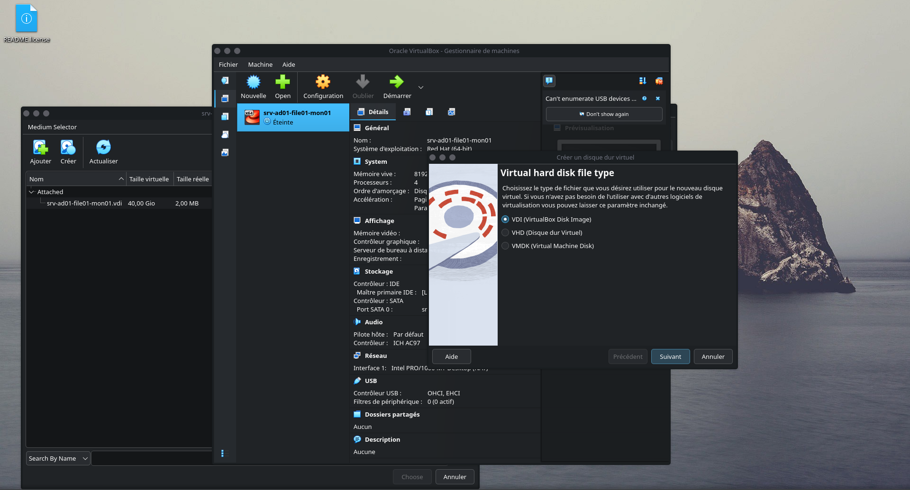

- [ ] Configuration des interfaces dans OPNsense

    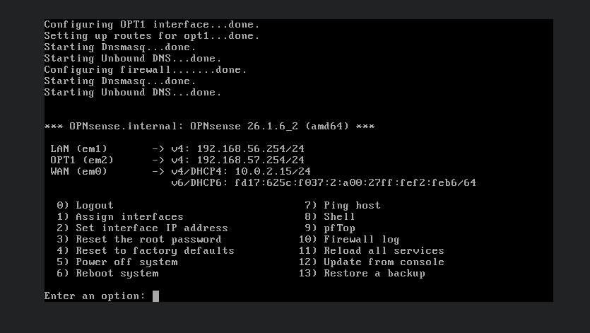

- [ ] Interface web OPNsense (Dashboard)

    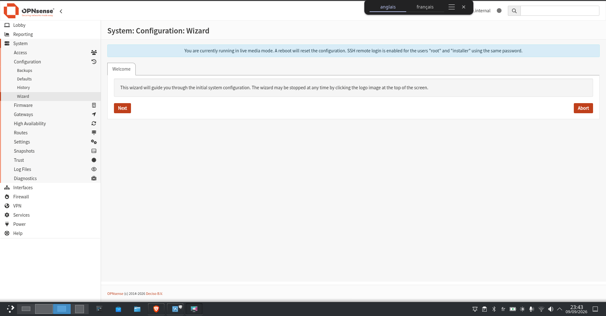
    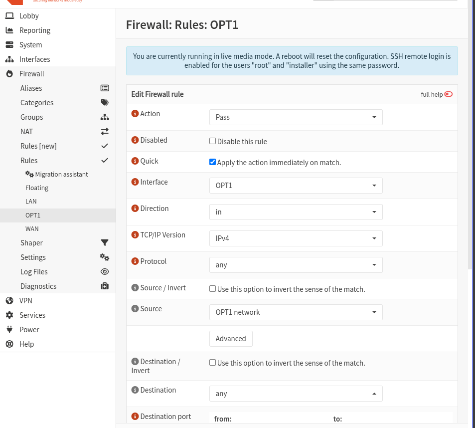

- [ ] Configuration réseau sur srv-ad01 (`ip addr show`)

    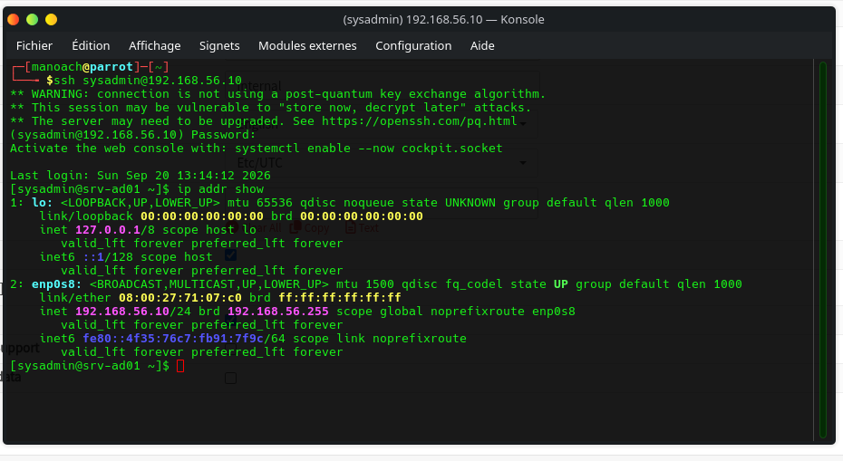

- [ ] Configuration réseau sur srv-backup01 (`ip addr show`)

    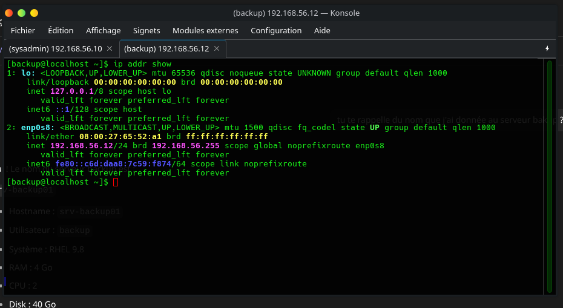

- [ ] Configuration réseau sur srv-web01 (`ip addr show`)

    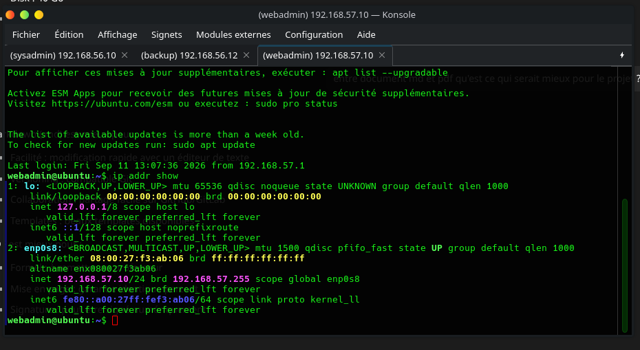

- [ ] Test de ping vers la passerelle LAN

    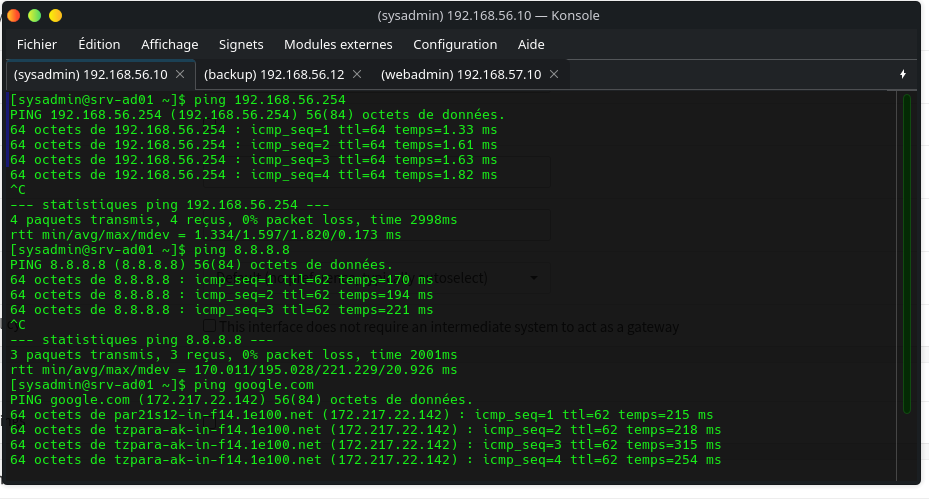

- [ ] Test de ping vers la passerelle DMZ

    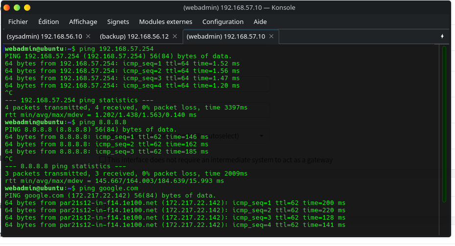

- [ ] Page web affichée depuis le PC Parrot

    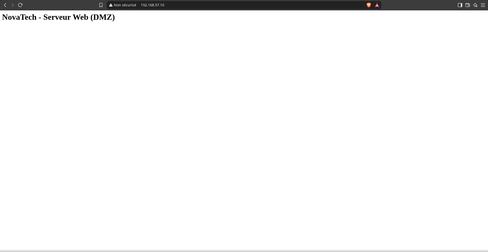

---

## 11. Prochaine étape (Jour 2)

- Installer FreeIPA sur srv-ad01
- Créer les comptes utilisateurs par service
- Configurer Kerberos et le DNS interne
- Tester l'authentification depuis les postes clients

---

## Ressources

- [Documentation OPNsense](https://docs.opnsense.org/)
- [Documentation RHEL 9](https://docs.redhat.com/en/documentation/red_hat_enterprise_linux/9)
- [VirtualBox Documentation](https://www.virtualbox.org/manual/)
